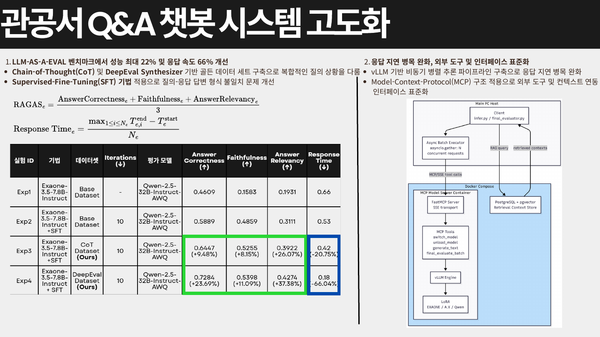

# Advanced QA Chatbot for Public Offices

[한국어](README.ko.md) | [English](README.en.md)

관공서 Q&A 챗봇의 응답 품질과 추론 지연을 함께 개선하기 위한 시스템 고도화 프로젝트입니다. <br>

## 프로젝트 설명
본 프로젝트는 관공서 FAQ 기반 질의응답 시스템에서 발생하는 답변 형식 불일치, 검색 컨텍스트 부족, 추론 지연 문제를 완화하기 위해 데이터 구축, 모델 학습, 평가, 추론, 외부 도구 연동 파이프라인을 통합적으로 개선합니다.

<details>
<summary><strong>[1] 데이터셋 구축 및 평가 구성</strong></summary>

관공서 FAQ 원천 데이터를 기반으로 Chain-of-Thought(CoT) 및 DeepEval Synthesizer를 활용해 학습과 평가에 사용할 골든 데이터셋을 구축했습니다.

| 데이터 | 역할 | 활용 목적 |
|--------|------|-----------|
| 원천 FAQ 데이터 | 관공서별 질의응답 문서 | 도메인 질의와 답변 형식 분석 |
| 합성 데이터 | DeepEval Synthesizer 기반 생성 데이터 | 다양한 질문 표현과 답변 패턴 확보 |
| 골든 데이터셋 | train/val/test 분할 데이터 | SFT 학습 및 LLM-as-a-Eval 평가 |

평가 단계에서는 baseline, RAG, CoT, SFT 실험을 분리하여 응답 품질과 응답 시간을 비교했습니다. 이를 통해 단순 생성 모델 대비 검색 컨텍스트, 추론 방식, 지도 미세조정이 성능에 미치는 영향을 확인할 수 있도록 구성했습니다.

</details>

<details>
<summary><strong>[2] 모델 고도화 및 추론 파이프라인</strong></summary>

답변 품질 개선을 위해 Supervised Fine-Tuning(SFT)을 적용하고, 추론 지연을 줄이기 위해 vLLM 기반 비동기 병렬 추론 파이프라인을 구성했습니다.

| 구성 요소 | 역할 |
|-----------|------|
| SFT | 관공서 FAQ 답변 형식과 도메인 응답 패턴 학습 |
| RAG | PostgreSQL + pgvector 기반 검색 컨텍스트 제공 |
| vLLM | 동시 요청 처리를 위한 고속 추론 서버 |
| MCP | 외부 도구, 컨텍스트 저장소, 추론 서버 연동 인터페이스 |

추론 파이프라인은 RAG query, retrieved contexts, final evaluation 흐름을 분리해 확장성을 높였으며, Model Context Protocol(MCP)을 통해 외부 도구 호출과 검색 컨텍스트를 표준화된 방식으로 연결할 수 있도록 설계했습니다.

</details>

## Key Contributions

```
1. Chain-of-Thought(CoT) 및 DeepEval Synthesizer 기반 골든 데이터셋 구축, LLM-as-a-Eval 벤치마크에서 성능 최대 22% 개선
2. Supervised Fine-Tuning(SFT)으로 질의-응답 답변 형식 불일치 문제를 완화하고, vLLM 비동기 병렬 추론으로 응답 속도 최대 66% 개선
3. PostgreSQL + pgvector 기반 RAG 컨텍스트와 Model Context Protocol(MCP) tool 호출을 연동하는 외부 도구 연동 구조 설계
```
<br>



[원본 PDF 보기](<../pdf/관공서 Q&A 챗봇 시스템 고도화.pdf>)

## 시작하기

### 1. 가상환경 설정

```bash
git clone https://github.com/JungSeong/Advanced-QA-Chatbot-for-Public-Offices.git
cd Advanced-QA-Chatbot-for-Public-Offices
python3 -m venv .venv
source .venv/bin/activate
pip install -r docker/requirements_exaone.txt
```

프로젝트의 Python 버전은 `.python-version` 기준 `3.12`입니다.

### 2. 가상환경 커널 등록

```bash
python3 -m ipykernel install --user --name .venv --display-name public-office-qa
```

위 가상환경을 커널로 사용하여 학습, 평가, 추론 스크립트와 노트북 실험을 실행할 수 있습니다.

### 3. 학습, 평가, 추론 실행

```bash
python main/train/main.py
python main/eval/evaluate.py
python main/infer/infer.py
```

## 저장소 구조

| 경로 | 역할 |
|------|------|
| `main/data/` | 원천 FAQ 데이터 처리, 합성 데이터 생성, 골든 데이터셋 분할 |
| `main/data/custom/` | DeepEval 기반 데이터 증강 및 CoT 데이터 생성 로직 |
| `main/data/golden_data/` | train/val/test 골든 데이터셋 |
| `main/train/` | SFT 학습 설정, 프롬프트, 모델 유틸리티 |
| `main/eval/` | LLM-as-a-Eval 기반 평가 로직과 실험 결과 |
| `main/infer/` | baseline/RAG/CoT/SFT 추론 실행 및 결과 생성 |
| `main/rag/` | PostgreSQL + pgvector 기반 RAG 인덱싱 및 검색 |
| `main/web/` | 웹 서버 및 애플리케이션 진입점 |
| `docker/` | vLLM, RAG, MCP 실행을 위한 Docker 구성 |
| `wandb/` | 학습 실험 로그와 실행 기록 |
| `pdf/` | 프로젝트 요약 PDF와 README 표시용 preview 이미지 |
| `readme/` | 한국어/영문 README 문서 |
